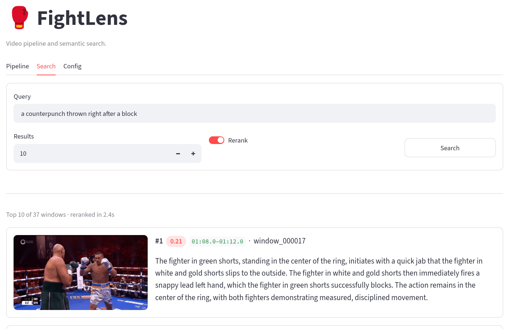
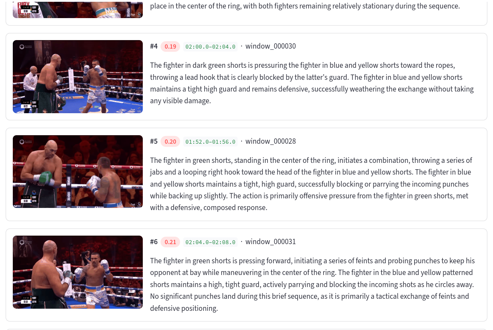
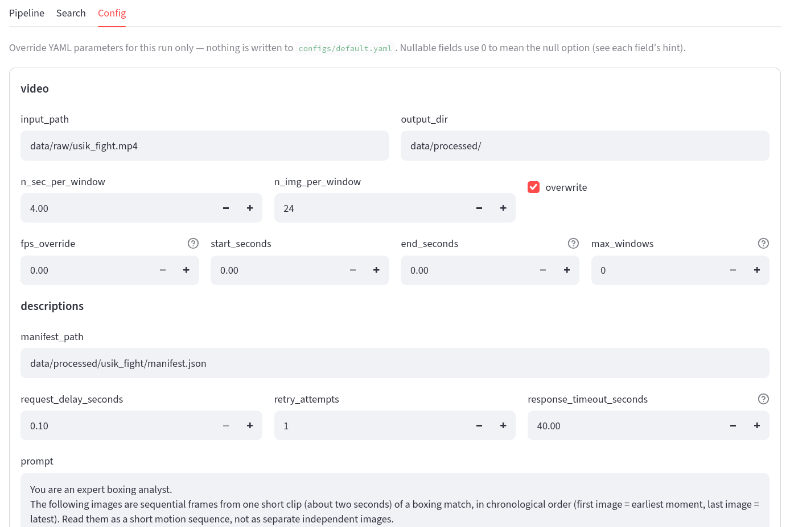

# FightLens

**Search fight footage by describing what you want to see.**

Type *"a counterpunch thrown right after a block"* → get the exact seconds where it happens, ranked, with playable clips.



---

## The idea

Searching video is hard. Searching text is solved. So FightLens turns video into text **once**, then never touches the video again.

```
video → 4s windows → 24 frames each → Gemini describes each window
                                              ↓
        ranked clips ← LLM rerank ← vector search ← embeddings
```

A punch lasts 0.2–0.5s, so sparse sampling misses punches entirely. Windows stay short, frames stay **dense inside** them — the model sees motion, not a still.

---

## Results

Round 1, Usyk vs Fury — 37 windows, 8 queries. **Precision@10** = how many of 10 returned windows actually match.

| Query type | Example | P@10 |
|---|---|---|
| Lexical | `jab`, `backed up against the ropes` | **10/10** |
| Defensive action | `a punch slipped by ducking underneath` | 7–8/10 |
| Negation | `nothing significant, only footwork` | 6/10 |
| Temporal | `a counterpunch right after a block` | 3/10 |

- **Accuracy tracks query structure.** Word matches are near-perfect; event ordering collapses — one vector per description loses sequence. Negation fails similarly: *"no punches thrown"* still contains *punches*.
- **Hubness:** 31/37 windows surfaced at least once; one appeared in 6 of 8 queries. Detail-rich descriptions sit moderately close to everything.
- **Limitation, stated honestly:** the rerank test ran with `top_n = top_k = 10`, so the reranker could only permute the same set — P@10 couldn't change by construction. Re-labelling gave 7/10 vs 8/10, so sub-1-window deltas are noise.

---

## What it costs

**Pay once to turn video into text. Searching it is free forever.**

| Step | Requests |
|---|---|
| Extract frames | **0** — local |
| Describe windows | **1 per window**, once per video |
| Embed | **0** — local model |
| Search | **0** |
| Rerank *(optional, off)* | 1 per search |

One round = **37 requests, once**. Fits the free tier.

- **Extract and describe are separate commands** — re-tune windows, re-extract, inspect frames without spending a token.
- **One multimodal request per window** with all 24 frames — not one per frame, not a frame→description chain that compounds errors.
- **Idempotent + content-addressed** — interrupted runs resume; editing the prompt re-embeds only changed windows.
- **Embeddings run locally** — no per-query cost, works offline, no key.
- **`start_seconds` / `end_seconds` / `max_windows`** cap the bill before the run starts.

---

## Not just boxing

The sport lives in one YAML value: `descriptions.prompt`. Nothing in the code knows what a jab is. Swap the prompt and the same pipeline searches training footage, security cameras, lectures or gameplay.

---

## Pipeline

Five stages, five commands. Each reads the previous file and writes its own — so any stage re-runs alone.

| # | Command | Does | Cost | Writes |
|---|---|---|---|---|
| 1 | `extract` | Splits video into windows, samples frames evenly across each | free | `windows/`, `manifest.json` |
| 2 | `describe` | All frames of a window → **one** Gemini request → 2–4 sentences | 1 req/window | `descriptions.json` |
| 3 | `embed` | Each description → 384-d normalized vector | free | `embeddings.npz` |
| 4 | `search` | Query → same encoder → dot product → top-k | free | — |
| 5 | *rerank* | Gemini reorders the shortlist in one request | 1 req/search | — |

Details worth knowing:

- Frame names encode origin — `img_03_frame_00000021_0000000.70s.jpg` = 4th kept frame, source frame 21, at 0.70s.
- Stage 2 is **resumable**: done windows are skipped, so an interrupted run restarts with the same command. Hung calls time out, get logged, and retry.
- Stage 3 keys each vector by a hash of its description; changing the model invalidates all of them.
- Stage 4 has **no index-building step** — `embeddings.npz` *is* the index.
- Stage 5 **degrades gracefully**: bad answer, timeout or API error → falls back to embedding order, never drops a candidate.

---

## Run it

**Needs:** Python 3.10+, ~2 GB disk (PyTorch), a free [Gemini key](https://aistudio.google.com/apikey). `ffmpeg` optional.

```bash
git clone https://github.com/Bohdanvtk/FightLens.git && cd FightLens
python -m venv .venv && source .venv/bin/activate   # Windows: .venv\Scripts\activate
pip install -e .
cp .env.example .env                                 # paste your key
```

`.env` is one line:

```
GEMINI_API_KEY=AIza...
```

Drop a video in `data/raw/`, point `configs/default.yaml` at it, then:

```bash
python -m fightlens extract     # free
python -m fightlens describe    # spends requests, resumable
python -m fightlens embed       # free, first run downloads ~80 MB
python -m fightlens search "clinch near the ropes"

python -m fightlens full        # stages 1-3 in one go
streamlit run scripts/app.py    # or do everything in the browser
```

Queries must be **English**. The key is read only when Gemini is called — `extract`, `embed` and `search` run without one. Re-running any stage is always safe.

| Problem | Fix |
|---|---|
| `GEMINI_API_KEY is missing` | key line in `.env` is empty |
| `search` says run `embed` first | `embeddings.npz` doesn't exist yet |
| Descriptions stopped halfway | re-run `describe`; `logs/` lists what failed |
| Choppy previews | install `ffmpeg`, set `preview.player: mp4` |

---

## GUI

A thin Streamlit layer over the same `Retriever` / `Embedder` / `rerank` objects the CLI uses — nothing reimplemented.



Each card plays a **clip built from that window's frames**, so you judge by watching, not by trusting the description.



The **Config** tab overrides any YAML value for the session only — experiments never mutate the committed config.

---

## Configuration

The two knobs that matter — your quality/cost dial:

| Key | Controls |
|---|---|
| `video.n_sec_per_window` | Window length. Shorter = finer granularity, more windows, more requests. |
| `video.n_img_per_window` | Frames kept per window, sampled evenly. More = better motion, higher cost per request. |

Missing punches? Shorten the window or add frames. Too expensive? Do the opposite.

| Section | Keys |
|---|---|
| `video` | `input_path`, `output_dir`, `n_sec_per_window`, `n_img_per_window`, `fps_override`, `start_seconds`, `end_seconds`, `max_windows`, `overwrite` |
| `descriptions` | `prompt`, `request_delay_seconds`, `retry_attempts`, `response_timeout_seconds` |
| `embedding` | `model_name`, `batch_size`, `device`, `normalize` |
| `search` | `top_k` |
| `rerank` | `enabled`, `top_n` |
| `preview` | `fps`, `player` — GUI only |

---

## Engineering notes

- **One embedder, two callers.** The same object encodes stored descriptions and incoming queries. Different models would put them in different spaces and return noise — silently. Sharing it makes that impossible.
- **Compute ≠ presentation.** `Retriever.search()` returns data and prints nothing. That's why the CLI, reranker and GUI all reuse it without duplicating a line.
- **Normalize at write time**, so query-time similarity is a plain dot product. At this scale a vector DB would be premature optimization.
- **Failures degrade, not crash.** Malformed rerank response → embedding order. Missing candidates → appended, never dropped. Hung API call → timeout, log, continue.
- **Tested where bugs are silent** — row alignment in the vector store, rerank response parsing. Both produce plausible wrong answers instead of errors. Loud-failing code isn't tested; that's deliberate.
- **Per-video artifact index.** Each `manifest.json` records what every stage produced and with which model, written atomically after the data file lands.

---

## Layout

```text
src/fightlens/
├── __main__.py     CLI + command dispatch
├── config.py       YAML loading, per-section validation
├── video.py        windowing, frame sampling, manifest
├── gemini.py       the only file that talks to the API
├── describe.py     window → description (resumable)
├── embeddings.py   Embedder + vector store — shared by embed and search
├── embed.py        descriptions → embeddings.npz
├── search.py       Retriever (returns data) + formatter (prints)
└── rerank.py       optional LLM reranking
scripts/app.py      Streamlit GUI
logs/               error JSON, written only when a run actually failed
```

Each video's output is self-contained — copy, archive or delete it as one unit:

```text
data/processed/<video>/
├── manifest.json        window metadata + artifact index
├── descriptions.json    per window: id, timecodes, frames, description
├── embeddings.npz       vectors · window_ids · desc hashes · model name
└── windows/window_000000/img_00_frame_00000000_0000000.00s.jpg …
```

Videos, frames, artifacts and `.env` are gitignored — the repo stays small and the key can't be pushed by accident.

---

## Stack

Python · Gemini (`google-genai`) · sentence-transformers · NumPy · OpenCV · Streamlit · PyYAML · pytest