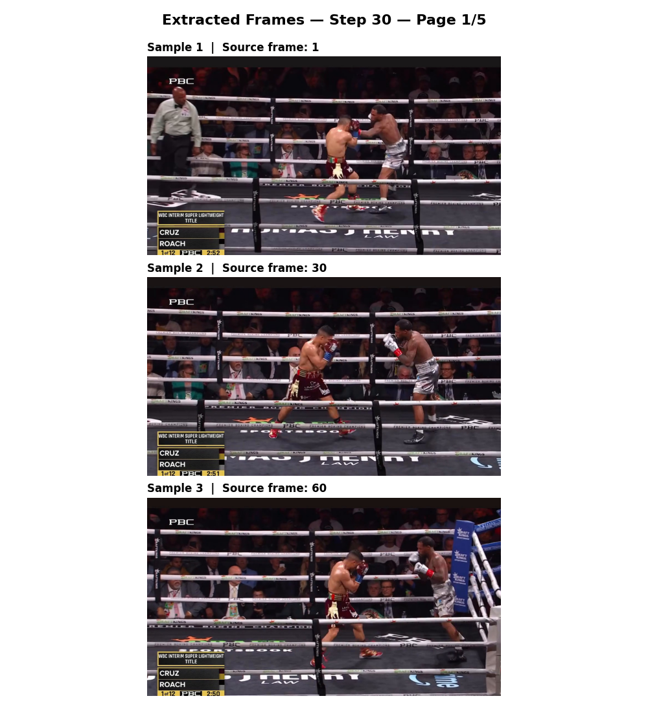
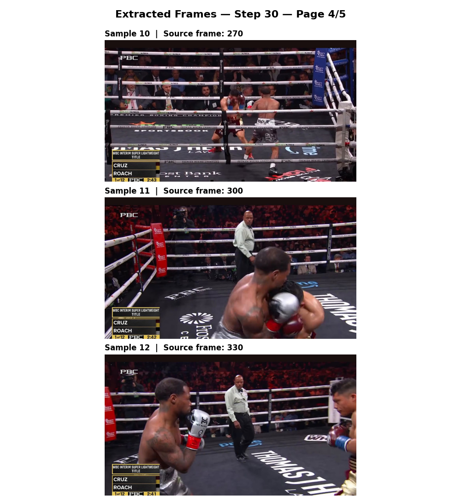

# FightLens

FightLens is a text-to-video semantic search system for combat sports footage.

The goal of the project is to let a user describe a fight moment in natural language, such as:

> "fighter lands a right hand"  
> "clinch near the ropes"  
> "body attack"

and retrieve the most relevant video clips from a recorded fight.

## Planned pipeline

```text
Fight video
→ short clips
→ sampled frames
→ Gemini-generated descriptions
→ text embeddings
→ semantic retrieval
→ LLM reranking
→ ranked video results
```

## Current progress

- [x] Initial project structure
- [x] Gemini API integration
- [x] YAML-based configuration
- [x] Video loading with OpenCV
- [x] Time-window splitting with evenly sampled frames
- [x] Per-window folders and a processing manifest
- [x] Frame visualization with source-frame labels
- [x] Automatic Gemini frame descriptions
- [x] Text embedding generation
- [x] Semantic search (embeddings.npz doubles as the index — no separate index step)
- [x] LLM reranking (optional second stage over the top-N candidates)
- [ ] Final video search interface

## Gemini integration

FightLens is connected to the Gemini API through the `google-genai` SDK.

The API key and model name are loaded from environment variables, keeping sensitive credentials outside the source code.

Gemini generates a description per extracted time window (see below). Frame extraction and description generation are two **separate** commands, so preprocessing never consumes API tokens.

## Time-window frame extraction

The preprocessing module splits a source video into short **time windows** and keeps a few representative frames from each one. One window will later map to a single multimodal request to Gemini.

Two parameters control this:

- `n_sec_per_window` — how many seconds of video one window spans. With 30 FPS and `n_sec_per_window: 2`, a full window covers ~60 source frames (window 0 ≈ frames 0–59, window 1 ≈ 60–119, ...).
- `n_img_per_window` — how many frames to keep from each window. They are sampled **evenly** across the whole window (not the first N in a row), with the first and last picks near the window boundaries.

FPS is read automatically from the video metadata. An optional `fps_override` acts as a fallback for videos with missing or broken metadata. The final, shorter-than-full slice of the video is **not** discarded — it becomes the last (partial) window.

The processed scope can be limited so only part of a long fight is extracted (and later described, keeping token costs under control):

- `start_seconds` / `end_seconds` — bound the extracted time range (`end_seconds: null` = until the end of the video). Timestamps stay relative to the original video.
- `max_windows` — cap on how many windows are kept (`null` = no limit).

### Output layout

```text
data/processed/<video_name>/
    manifest.json
    windows/
        window_000000/
            img_00_frame_00000000_0000000.00s.jpg
            img_01_frame_00000012_0000000.40s.jpg
            ...
        window_000001/
            ...
```

Each image name encodes its local position in the window, its source frame index, and its timestamp. The `manifest.json` records per-window metadata (frame ranges, timestamps, saved images, whether the window is full or partial) plus global video info, and is used later to tie Gemini descriptions and embeddings back to a specific moment.

All parameters are configured through YAML.

## Gemini window descriptions

A separate step sends each extracted window to Gemini: all of the window's frames go into **one** multimodal request, in chronological order, together with a boxing-analyst prompt. Gemini reads them as a short motion sequence and answers with 2–4 sentences describing the action (who attacks, punch type, target, result, defense, ring position).

The results accumulate in `descriptions.json` **inside the video's own processed folder** (`data/processed/<video>/descriptions.json`, next to `manifest.json`), so every video's artifacts stay self-contained. One entry per window:

```json
{
  "window_id": "window_000000",
  "start_sec": 0.0,
  "end_sec": 2.0,
  "frames": ["data/processed/test_video/windows/window_000000/img_00_....jpg"],
  "description": "The fighter in red shorts ..."
}
```

The step is idempotent: windows already present in the JSON are skipped, and the file is saved after every window, so an interrupted run can simply be restarted. Requests run sequentially with a configurable pause between calls (`request_delay_seconds`, for free-tier rate limits), and a failed call is retried once.

## Local window embeddings

A separate, **purely local** step turns each window's description into an embedding vector. It never calls Gemini or any paid API — it runs a [sentence-transformers](https://www.sbert.net/) model on this machine (the first run downloads and caches the model, ~80MB, from Hugging Face).

For every video it reads `data/processed/<video>/descriptions.json`, encodes each window's description into a 384-dimensional, L2-normalized vector (normalizing here makes later similarity a plain dot product), and stores all vectors together in a single `data/processed/<video>/embeddings.npz` alongside their `window_ids`. Storing normalized vectors keeps the whole video's index in one small file that the search step can load directly.

The step is idempotent and content-addressed: each vector is keyed by a hash of its exact description text, so re-running only re-embeds windows whose description changed (or everything, if the configured model changed — vectors from different models are not comparable). Running it twice with no input changes embeds nothing the second time.

It is configured under `embedding:` in the YAML:

- `model_name` — the local sentence-transformers model (default `all-MiniLM-L6-v2`, 384-dim). The output dimension is fixed by the model, so it is not a config key.
- `batch_size` — how many descriptions to encode per forward pass (default `32`).
- `device` — `auto` (let the model pick cuda/cpu), or force `cpu` / `cuda`.
- `normalize` — L2-normalize each vector (default `true`).

## Semantic search

The final, **purely local and read-only** step: search a video's windows with a natural-language query.

```bash
python -m fightlens search "clinch near the ropes"
```

There is no separate index-building step — `embeddings.npz` (written by Step 4) already holds every window's normalized vector, so it's loaded and matrix-multiplied directly. The query string is encoded with the exact same local Embedder (same `embedding:` config) that produced the stored vectors, so both live in the same vector space; since the vectors are already L2-normalized, cosine similarity is just a dot product. Results are joined back to `descriptions.json` by `window_id` to print each match's timecode and description, ranked by similarity, highest first.

It is configured under `search:` in the YAML:

- `top_k` — how many top matches to print (default `10`).

Notes:

- The query must be in **English** — descriptions are generated in English and the default `all-MiniLM-L6-v2` model is English-centric.
- This step makes no Gemini or other API calls and writes nothing to disk (no artifact, no manifest changes).

## LLM reranking (optional)

Embeddings match on surface meaning and can miss the nuance of a fight moment — *landed* vs *blocked/slipped*, attacker vs defender, the exact punch type. An optional second stage over the search results fixes this: after embeddings narrow the video to the top `top_n` candidates, Gemini reorders **just those** by how well each window's description actually answers the query, in **one** text request. This is retrieve-then-rerank — cheap embeddings recall a wider net, then the LLM re-ranks only the shortlist.

It is **off by default** and configured under `rerank:` in the YAML:

- `enabled` — `false` (default) makes `search` behave exactly as the pure-embeddings step above: **zero Gemini calls**, identical output. `true` sends one Gemini request per search.
- `top_n` — how many embedding candidates to send to the reranker (default `10`, the wider recall net). Should be `>= search.top_k`, since you still see `top_k` results **after** reordering.

```bash
# Enable it by setting `rerank.enabled: true` in configs/default.yaml, then:
python -m fightlens search "left hook that slips past the guard"
```

Notes:

- The reranker reuses the **same Gemini model** as the description step (the `GEMINI_MODEL` env var) — no separate model key or credentials.
- It retrieves `top_n` from embeddings, reranks them, then trims to `search.top_k` for display (the header line shows `(reranked)`).
- It **degrades gracefully**: on any failure — a garbage/empty answer, a timeout, an API error — it falls back to the plain embedding order instead of crashing, and it never loses or duplicates a candidate.
- Gemini is called **only when enabled**; with `enabled: false` this stage is skipped entirely.

## Per-video manifest as the artifact index

Each video's `manifest.json` is the single index of that video's artifacts. The data files stay pure and never point at each other; instead every step registers what it produced under an `"artifacts"` section (written atomically, only after the data file is fully saved):

```json
"artifacts": {
  "descriptions": { "path": "descriptions.json", "model": "gemini-2.5-flash", "count": 13 },
  "embeddings":   { "path": "embeddings.npz", "model": "all-MiniLM-L6-v2", "dim": 384, "count": 13 }
}
```

## Frame sampling preview

The frames of a single window can be displayed in a vertical sequence with source-frame and timestamp labels parsed from the file names (see `scripts/inspect_frames.py`, `VIDEO_NAME` / `WINDOW_ID`).





## Running the project

Configure the input video, window duration, images per window, and the descriptions step in:

```text
configs/default.yaml
```

Then run the two pipeline steps separately:

```bash
# 1. Extract window frames (no API calls, spends no tokens).
python -m fightlens extract

# 2. Generate Gemini descriptions for the extracted windows.
python -m fightlens describe

# 3. Embed the window descriptions locally (no API calls, spends no tokens).
python -m fightlens embed

# 4. Search the embedded windows with a natural-language query (no API calls).
python -m fightlens search "clinch near the ropes"

# Or run extract + describe + embed in one go:
python -m fightlens full
```

`python -m fightlens` without a command still runs extraction only. Steps 2 and 3 are separate on purpose: `describe` spends Gemini tokens, while `embed` and `search` are purely local. The description prompt and retry count live in the `descriptions:` section of the YAML (`prompt`, `retry_attempts`); the embedding model and device live in `embedding:` (`model_name`, `batch_size`, `device`, `normalize`); how many search results to print lives in `search:` (`top_k`). Optional LLM reranking of the search results lives in `rerank:` (`enabled`, `top_n`) and is off by default — see *LLM reranking (optional)* above.